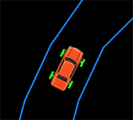
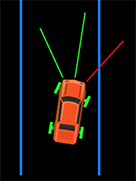

# Introduction

Neurolution is a simulation of cars controlled by neural networks, which evolves to learn to drive.

# Overview

- The simulation is web-based that runs on a browser.
- Much of the code is written in Typescript.
- Phaser 3 is used as a game engine.
- Box2D powers the physics engine.
- Network network engine powers each car.
- Network networks evolve through generations, instead of other training methods such as stochastic gradient descent.

# Why TypeScript?

JavaScript doesn't support static typing. Moreover, standardized JavaScript code is generated by the TypeScript compiler, and most errors are caught at compile-time instead of at run-time.

# Why Phaser 3?

[Phaser 3](https://phaser.io/phaser3) is used as a game engine, which is required for setting up and controlling the scene of the simulation. It basically provides a framework for the simulation which would be much more troublesome with vanilla JavaScript.

# Why Box2D?

[Box2D](https://box2d.org/) is the legendary physics engine, which was found in almost every single physics game on the web, back in the good old days when Adobe Flash used to rule the web.

Here, it's used mainly for collision detection, and proximity calculation; especially using techniques like [ray casting](https://en.wikipedia.org/wiki/Ray_casting).

# Directory Structure

> Directories are in bold, while files are italicized.

- **assets** - Contains all the sprites and resources associated with the simulation.
- **src**
	- **libs**
		- **common** - Contains scripts required by other libs.
		- **neural_network** - Represents the entire neural network associated stuff, including evolution.
		- **phaser** - Everything related to the game engine's (Phaser 3) preload, setup, creation, update, etc.
		- **simulation** - Holds code related to the simulation, such as the car, road tracks, etc.

- **static**
	- **js** - All the JavaScript scripts, such as that generated after compiling all the TypeScript files, and external libraries such as Box2D.

- *index.js* - A node.js script which simply serves *index.html* in a server.
- *index.html* - Webpage where the entire simulation is hosted.
- *tsconfig.json* - TypeScript config file, which holds the location[s] of the TypeScript scripts, where to save the resultant JavaScript script, and other attributes.

# Components

The simulation is divided into several components, each dealing with unique tasks.

## Common

The common component contains:

- **box2dsetup.ts** which sets up variables required for linking to Box2D namespace, and necessary attributes.

- **helpers.ts** contains helping procedures for cloning objects, doing mathematical operations, etc.

- **physics.ts** sets up contact listeners for collision between cars and tracks, sets up the world, etc.

## Neural Network

This component contains:

- **activation_functions.ts** holds all the activation procedures.
- **engine.ts** holds procedures which represents the Neural Network engine only (no trainer).
- **evolution.ts** contains procedures required for neural networks to evolve.

## Phaser

This component contains:

- **create.ts** holds a *create* procedure which is triggered by Phaser when the scene is created.
- **game.ts** is the main game handler, which defines all the variables and sets up all the document event handlers necessary for the simulation.
- **preload.ts** contains a procedure which is triggered before the scene is created.
- **update.ts** holds a procedure which is called when the scene is updated (every step/frame).

## Simulation

This component contains:

- **car.ts** contains almost everything related to the cars in the simulation.
- **road_tracks.ts** contains almost everything related to the road tracks in the simulation.

# Evolution

## Introduction

In this section, we'll look at how the neural networks evolve in each generation.

Before we proceed any further, let's get familiar with few terms:

- **generation** is a set of neural networks involved in the evolution.
- **breeding** refers to reproduction of neural networks in the current generation to produce a new generation.
- **crossover** is a technique of reproduction of neural networks.
- **mutation** is a technique of altering the weights and biases of a neural network slightly with a certain degree of randomness.
- **fitness** is a value which determines how well a neural network performs in the test, based on few criterias.

Here are few facts:

- A new generation is always reproduced from the previous one.
- Only the best fit individuals (neural networks) are used for creating the newer generation.
- In this simulation, the distance travelled, and the average speed is considered for calculating the fitness.
- Crossover involves using the gene pool of the best fit individuals to craft a newer one.

## The Cars

The simulation session begins with [a generation of cars](https://github.com/nahiyan/neurolution/blob/dd1ca68f497cc5506482a2547c1314640b3a9421/src/libs/neural_network/evolution.ts#L54). The cars are each powered by a neural network, and are equipped with 3 proximity sensors at the front. The cars can only accelerate, and steer upto a certain angle (15 degrees).

The neural networks each got [3 input neurons](https://github.com/nahiyan/neurolution/blob/dd1ca68f497cc5506482a2547c1314640b3a9421/src/libs/simulation/car.ts#L534), and [2 output neurons](https://github.com/nahiyan/neurolution/blob/dd1ca68f497cc5506482a2547c1314640b3a9421/src/libs/simulation/car.ts#L541). The 3 input neurons are fed [values from the 3 proximity sensors](https://github.com/nahiyan/neurolution/blob/dd1ca68f497cc5506482a2547c1314640b3a9421/src/libs/simulation/car.ts#L460). And [the values from the output neurons directly impact acceleration, and torque applied to the front axle](https://github.com/nahiyan/neurolution/blob/dd1ca68f497cc5506482a2547c1314640b3a9421/src/libs/simulation/car.ts#L559).

In other words, the neural network controls the acceleration, and the steering of the car.

You can change the settings related to the population size of each generation, layer sizes of the neural networks, etc by modifying the [definition of the initial model](https://github.com/nahiyan/neurolution/blob/dd1ca68f497cc5506482a2547c1314640b3a9421/src/libs/phaser/preload.ts#L8).

## New Generation

One generation is tested in the scene at a time. Whenever a car hits the boundary of the track, it is immediately removed from the scene, and its [fitness value](https://github.com/nahiyan/neurolution/blob/dd1ca68f497cc5506482a2547c1314640b3a9421/src/libs/neural_network/evolution.ts#L74) is marked. When all the cars in a generation are [removed](https://github.com/nahiyan/neurolution/blob/dd1ca68f497cc5506482a2547c1314640b3a9421/src/libs/phaser/update.ts#L19), the generation is over, and [a new generation needs to be produced to continue the evolution](https://github.com/nahiyan/neurolution/blob/dd1ca68f497cc5506482a2547c1314640b3a9421/src/libs/neural_network/evolution.ts#L82).

To do so, the individuals (cars) are ranked based on their fitnesses, and [the best fit individuals are chosen for reproduction](https://github.com/nahiyan/neurolution/blob/dd1ca68f497cc5506482a2547c1314640b3a9421/src/libs/neural_network/evolution.ts#L187). [Crossover](https://github.com/nahiyan/neurolution/blob/dd1ca68f497cc5506482a2547c1314640b3a9421/src/libs/neural_network/evolution.ts#L133) is used as a technique of reproduction, where a new neural network is created using the weights and biases randomly selected from the neural networks of selected individuals. In other words, crossover creates new neural networks using the genes of best fit individuals.

After a new generation is created, each of its neural networks are [mutated](https://github.com/nahiyan/neurolution/blob/dd1ca68f497cc5506482a2547c1314640b3a9421/src/libs/neural_network/evolution.ts#L3). This ensures that none of the weights and biases are exactly copied from the parents, similar to what happens in nature, that is - genes are never copied 100% accurately.
